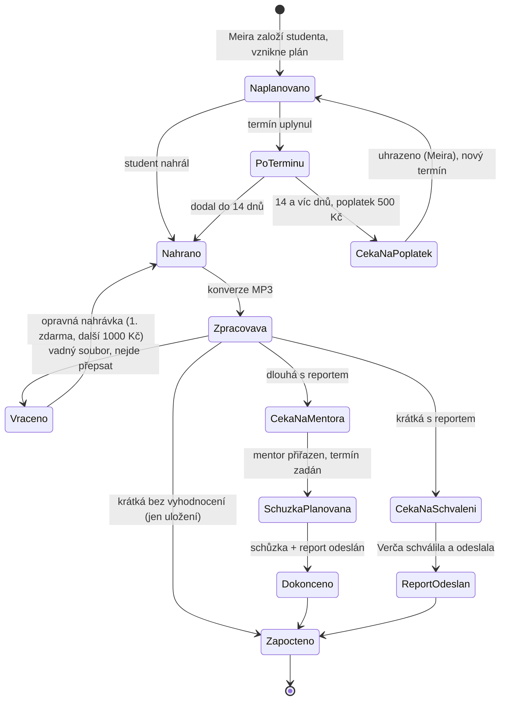

# Systém pro správu a vyhodnocování koučovacích nahrávek

## Zadání, verze 2.1

| | |
|---|---|
| Datum | 29. 7. 2026 |
| Verze 2.1 | Zapracovány odpovědi na otázky O2 až O12 (rozhodnutí R31 až R38). Verze 2.0 přinesla strukturu tří programů, roli Meira, poplatky, kaskádu, matici, technologie a rozpočet |
| Stav | Finální zadání připravené k zahájení stavby. Otevřená zůstává jediná otázka O1 (kap. 15) + dodávky obsahu (kap. 16) |
| Doména | certifikace.coachville.eu |

**Značky:** ✅ rozhodnuto · 🟡 návrh čekající na potvrzení · 🔴 otevřené

---

## 1. Shrnutí

Webová aplikace pro kompletní správu agendy studentských nahrávek CoachVille: Meira založí studenta a systém mu vygeneruje individuální plán dodávek, student nahrává přes jednorázový přihlašovací odkaz (žádná hesla), systém nahrávku převede na text a vyhodnotí podle Master Promptu, Verča přiřazuje mentory a schvaluje krátké reporty, mentoři vedou hodinové schůzky k dlouhým nahrávkám, systém hlídá termíny, vybírá poplatky za skluzy a opravy a vše dokumentuje až po certifikační spis.

Rozsah: 100 až 250 studentů ve třech programových variantách (ACC, upgrade ACC na PCC, kompletní ACC+PCC). Termín: první ostrá nahrávka do září 2026. Technologie: Supabase + GitHub + Vercel, vyhodnocení přes Claude API, staví Aleš s AI nástroji.

Hlavní kritérium úspěchu: negenerovat operativní zátěž. Studenti si většinu odehrají sami, Verča řídí výjimky, Meira spravuje vstupy a platby, systém dělá zbytek.

---

## 2. Kontext ICF (ověřeno 28. 7. 2026, beze změny)

| Téma | Dnes (žádosti do 31. 3. 2027) | Nově (žádosti od 1. 4. 2027) | Jistota |
|---|---|---|---|
| Hodnocení výkonu ACC/PCC | Jednorázová performance evaluation (nahrávka + doslovný transkript) | Ruší se. Nahrazuje ji průběžné pozorování více session mentorem + Session Observation Forms | Vysoká |
| Kdo hodnotí / mentoruje kandidáty | Asesoři ICF, mentor koučové | Mentoři se specializací MCS, povinné od 1. 1. 2027 | Vysoká |
| Nahrávky pro ICF | MP3, WMA, MP4, M4A; max 95 MB; jeden soubor | Na ICF se neposílají, zůstávají u vzdělavatele jako podklad a dokumentace | Vysoká / detaily střední |
| Kritéria | Nové Minimum Skills Requirements + BARS od 1. 1. 2026 | Stejná, hodnotí se průběžně | Vysoká |

Důsledky: systém je vaše vlastní hodnoticí infrastruktura (přesně to nový režim vyžaduje), formát souborů je vaše volba (přijímat cokoli, konvertovat na MP3), reporty navrhnout tak, aby šly přemapovat na Session Observation Forms, Master Prompt stavět na MSR/BARS a PCC markerech.

🔴 Trvá: ověřit v ICF handbooku přesné povinnosti Level 1/2 vzdělavatelů po 1. 4. 2027 (minimální počet pozorování, oficiální formuláře, retence). Aleš doplní později, případně Helča. Zdroje v kap. 19.

---

## 3. Programy a povinnosti studentů ✅

| Program | Dlouhé nahrávky (20 až 40 min) | Krátké nahrávky (10 až 15 min) | Časový rámec |
|---|---|---|---|
| **ACC samostatně** | 3, každá: oficiální vyhodnocení + 1 hod individuálně s mentorem | 5 celkem: 3 s reportem e-mailem, 2 bez vyhodnocení | 12 až 15 měsíců |
| **Upgrade ACC na PCC** | 3, každá: oficiální vyhodnocení + 1 hod individuálně s mentorem | 1 s reportem e-mailem | výchozí 12 měsíců ✅ |
| **Kompletní (ACC+PCC současně)** | 6, každá: oficiální vyhodnocení + 1 hod individuálně s mentorem | 6 celkem: 4 s reportem e-mailem, 2 bez vyhodnocení | 24 až 36 měsíců, ACC kritéria splněná v prvních 12 až 15 měsících |

**Tři typy položek plánu:**

1. **Dlouhá s vyhodnocením a schůzkou:** oficiální vyhodnocení se přikládá k žádosti o certifikaci, následuje 1 hodina individuálně s mentorem.
2. **Krátká s reportem:** AI vyhodnocení schválené Verčou odchází studentovi e-mailem.
3. **Krátká bez vyhodnocení:** odevzdává se a eviduje, ale nezpracovává se (jen uložení) 🟡.

🔴 **Interpretace kompletního programu** (otázka O1, zůstává otevřená, Aleš upřesní později): kompletní program čtu jako dvě navazující fáze: ACC fáze (3 dlouhé + 5 krátkých, z toho 3 s reportem a 2 bez) a PCC fáze (3 dlouhé + 1 krátká s reportem). Součty přesně odpovídají zadání (6 dlouhých, 6 krátkých, 4 s reportem, 2 bez). Zbývá potvrdit interpretaci a určit, které krátké v pořadí jsou bez vyhodnocení. Stavbu to neblokuje: typ položky je v generátoru plánů atribut, ne natvrdo dané pořadí, odpověď se doplní kdykoli bez přestavby.

**Délky a tolerance ✅:** dlouhá 20 až 40 minut, krátká 10 až 15 minut, tolerance ±5 minut, absolutní strop 60 minut. Nahrávka mimo toleranci: ✅ přijme se a upozorní se Verča, nepočítá se automaticky jako vrácená. **Vrácení nahrávky jen z technických důvodů ✅:** vadný soubor, nejde pořídit transkript.

**Cílové datum certifikace ✅:** u studenta lze zadat cílové datum a systém proporčně přepočítá rozložení termínů (pro studenty, kteří spěchají).

---

## 4. Rozhodnutí (decision log verze 2.0) ✅

| # | Rozhodnutí |
|---|---|
| R1 | Rozsah: 100 až 250 studentů v prvním roce |
| R2 | Samostatná aplikace na certifikace.coachville.eu, odkazovaná z Kajabi a Mighty Networks |
| R3 | Staví a provozuje Aleš s AI nástroji (Claude); stack Supabase + GitHub + Vercel |
| R4 | První ostrá nahrávka do září 2026 |
| R5 | Přihlašování jednorázovým odkazem pro všechny role, hesla se nepoužívají |
| R6 | Struktura programů a povinností dle kapitoly 3 |
| R7 | Ruční přiřazování mentorů + statistiky vytížení pro vyvažování |
| R8 | Mentoři: Helena Seifertová, Pavel Heidler, Silvie Ptašková; správa mentorů (přidat, editovat, odebrat); každý dodá Calendly odkaz + embed do profilu |
| R9 | MCS získají: Helena Seifertová, Pavel Heidler, Silvie Ptašková, Aleš Vrána (🔴 termín; deadline ICF 1. 1. 2027) |
| R10 | Kapacita mentorů: zatím cca 10 hodin měsíčně na mentora, flexibilní (viz riziko v kap. 14) |
| R11 | Krátké s reportem: AI vyhodnotí, Verča schválí a odešle e-mailem |
| R12 | Dlouhé: student vidí oficiální vyhodnocení až po schůzce; odemyká ho mentorovo označení „schůzka dokončena + report odeslán". Krátké se odemyká schválením Verči |
| R13 | Schůzky přes Calendly mentorů; Verča má v profilech mentorů embedy, aby mohla se studenty plánovat i telefonicky |
| R14 | Dva Master Prompty (dlouhé / krátké nahrávky), editovatelné a ukládané v admin sekci, + knihovna textů ICF standardů. Systém se staví bez nich, Aleš je dodá později |
| R15 | Tón zpětné vazby: profesionální, seriózní, dle kritérií a kompetencí ICF, férový, přímý, bez humorných prvků |
| R16 | Souhlas klienta: namluvený na začátku každé nahrávky (pro účely zpětné vazby a vyhodnocení); klient neuvádí příjmení, nahrávky jsou anonymní; písemné formuláře se neřeší |
| R17 | Archivuje se audio i dokumenty, standardní doba 5 let |
| R18 | Vrácená (vadná) nahrávka se nepočítá; první opravná zdarma, každá další 1 000 Kč (hradí se mimo systém, Meira úhradu jen eviduje) |
| R19 | Po 14 dnech neplnění: dodatečný termín a zpracování za 500 Kč; student dostane Stripe odkaz, úhradu označí Meira. Je to jediný platební odkaz v systému |
| R20 | Notifikační kaskáda: studentovi 21, 14, 7 a 3 dny před termínem, v den termínu a 3 dny po; Verče 4 dny po; Verče a Alešovi 14 dní po |
| R21 | Plány smí editovat jen Verča, Aleš a Meira; starší studenti se migrují ručním založením a úpravou plánu |
| R22 | Meira (delivery@coachville.eu): koordinátorka; zakládá studenty, spouští plány, řeší přihlašovací odkazy a evidenci plateb. Plný admin (prompty, nastavení, mentoři) je jen Aleš |
| R23 | Chybová hlášení systému na ales@coachville.eu |
| R24 | Notifikace odcházejí z notifikace@coachville.eu přes transakční službu (technika v kap. 11) |
| R25 | Podpora studentů: Verča + sekce „Jak na to" s videi v aplikaci |
| R26 | Sekce „Podmínky certifikace" v aplikaci, text dodá Aleš |
| R27 | Přístupová matice dle kapitoly 6 |
| R28 | Metriky úspěchu z kapitoly 18 platí |
| R29 | Historické nahrávky na kalibraci existují ve velkém množství, Aleš dodá později |
| R30 | Rozpočet: minimální varianta, rozpad v kapitole 13 |
| R31 | Výchozí délky plánů: ACC 12 měsíců, upgrade 12, kompletní 30; zadané cílové datum certifikace vše proporčně přepočítá |
| R32 | Mentor smí oficiální vyhodnocení před odesláním upravit; upravená verze je oficiální |
| R33 | Termín schůzky se pro start zapisuje ručně (Verča nebo mentor), synchronizace s Calendly později |
| R34 | Schůzka k dlouhé nahrávce do 30 dnů. Verča dostane upozornění hned, jakmile je dlouhá nahrávka vyhodnocená, a pak každých 7 dní, dokud termín schůzky nestanoví |
| R35 | Stripe slouží jen poplatku 500 Kč za nový termín vyhodnocení: student zaplatí odkazem, Meira označí zaplaceno |
| R36 | Migrace (pár desítek studentů): import s počtem hotových praktik; chybí 1 → 1 dlouhá + 1 krátká; chybí 2 → 2 dlouhé + 3 krátké; chybí 3 → plný plán 3 dlouhé + 5 krátkých |
| R37 | Nahrávky budou česky i slovensky; transkripce se před volbou služby testuje na obou jazycích |
| R38 | Retence 5 let se počítá od data nahrání souboru |

---

## 5. Návrhové principy

1. **Zleva doprava jednoduché.** Každá role vyřídí svůj krok na pár kliknutí, i z mobilu.
2. **Výjimkový management.** Systém pracuje, lidé rozhodují. Verča nehlídá pás, hlídá kontrolku.
3. **Zodpovědnost nesou studenti.** Plán, termíny, upomínky i poplatky míří na ně.
4. **AI připravuje, člověk potvrzuje.** Verča schvaluje krátké reporty, mentor drží dlouhé. Automatizace se povoluje přepínačem, ne vírou.
5. **Každý krok zanechá stopu.** Certifikační spis i audit se složí jedním klikem.
6. **Žádná technická bariéra.** Jakýkoli formát, konverze na serveru, návody, přihlášení bez hesel.

---

## 6. Role a přístupová matice ✅

**Student:** vidí jen svůj profil: termíny, kdy má dodat nahrávky, stav (dodáno + datum / nedodáno), termín schůzky s mentorem, a u nahrávek si stahuje vyhodnocení (dlouhé se odemyká po schůzce, krátké po schválení Verčou). Nahrává, potvrzuje, že nahrávka obsahuje souhlas klienta.

**Mentor:** vidí jen jemu přiřazené nahrávky: jméno a příjmení studenta, audio, transkript, report zpětné vazby. Vyhodnocuje pouze dlouhé nahrávky. Označuje „schůzka dokončena + report studentovi odeslán". Ve svém profilu vidí přehled realizovaných schůzek (jméno studenta, datum).

**Verča (provoz):** seznam studentů a jejich profily s termíny dodání; fronta nahrávek čekajících na přiřazení; přiřazuje mentora; profily mentorů s embedovanými Calendly (telefonické plánování se studenty); statistika přiřazení na mentora (vyvažování zátěže); semafor neplničů; schvalování a odesílání krátkých reportů; editace plánů.

**Meira (koordinátorka):** zakládá studenta, volí program (ACC / upgrade / kompletní), zadává datum startu a případné cílové datum certifikace, spouští vytvoření plánu; vidí profil a plán studenta; posílá nové přihlašovací odkazy; edituje plány; eviduje úhrady poplatků.

**Aleš (admin):** vidí vše, přístup do všech sekcí; správa Master Promptů a knihovny standardů; správa mentorů; nastavení systému.

| Funkce | Student | Mentor | Verča | Meira | Aleš |
|---|---|---|---|---|---|
| Vlastní profil a plán | ✔ | | všech | všech | ✔ |
| Upload nahrávky | ✔ | | | | ✔ |
| Audio, transkript, report | jen svá vyhodnocení po odemknutí | přiřazené | ✔ | ✔ | ✔ |
| Fronta a přiřazování mentorů | | | ✔ | | ✔ |
| Schvalování krátkých reportů | | | ✔ | | ✔ |
| Statistiky mentorů | | své | ✔ | | ✔ |
| Založení studenta, start, program, cílové datum | | | | ✔ | ✔ |
| Editace plánů | | | ✔ | ✔ | ✔ |
| Přihlašovací odkazy studentům | | | | ✔ | ✔ |
| Evidence plateb (500 / 1 000 Kč) | | | | ✔ | ✔ |
| Master Prompty, standardy, nastavení, správa mentorů | | | | | ✔ |

---

## 7. Životní cyklus nahrávky

**Toky slovy:**

- **F1 Onboarding:** Meira založí studenta (jméno, e-mail, program, datum startu, případně cílové datum certifikace) → systém vygeneruje plán → studentovi odejde uvítací e-mail s přihlašovacím odkazem, podmínkami certifikace a návodem.
- **F1b Migrace staršího studenta:** Meira založí studenta a plán ručně upraví: smaže položky, které už neplatí, označí historicky splněné, nastaví termíny zbývajících.
- **F2 Upload:** přihlášení odkazem → výběr položky plánu → nahrání souboru (mobil i počítač, jakýkoli formát včetně videa ze Zoomu, viditelný průběh) → checkbox „nahrávka obsahuje souhlas klienta" → potvrzení.
- **F3 Zpracování:** konverze na MP3 → krátká bez vyhodnocení se rovnou uloží a započte → ostatní: transkripce s rozlišením mluvčích → příslušný Master Prompt → report (koncept).
- **F4 Dlouhá:** jakmile je vyhodnocení hotové, dostane Verča upozornění (a pak každých 7 dní, dokud termín schůzky nestanoví) → přiřadí mentora (vidí vytížení) → mentor dostane e-mail s odkazy → termín schůzky do 30 dnů (student přes Calendly, nebo Verča telefonicky přes embed; datum se pro start zapisuje ručně) → schůzka → mentor může vyhodnocení upravit, upravená verze je oficiální → označí „schůzka dokončena + report odeslán" → studentovi se vyhodnocení odemkne ke stažení → započteno.
- **F5 Krátká s reportem:** Verča ve frontě otevře, případně upraví, schválí → odejde e-mailem, objeví se v profilu studenta → započteno.
- **F6 Neplnění:** kaskáda upomínek (R20) → po 14 dnech položka „vyžaduje poplatek 500 Kč" → e-mail se Stripe odkazem → Meira označí uhrazeno → zadá se nový termín → jede se dál.
- **F7 Opravná nahrávka:** technicky vadná se vrací a nepočítá; první oprava zdarma, druhá a další za 1 000 Kč. Tento poplatek se hradí mimo systém (faktura či převod) a Meira v systému jen označí úhradu; Stripe odkaz je vyhrazen poplatku 500 Kč.
- **F8 Certifikační spis:** průběžná kompletnost u studenta (např. 2/3 dlouhé, 4/5 krátkých); na konci export oficiálních vyhodnocení a evidence.

---

## 8. Plány a notifikace

**Šablony programů** (verzované): ACC, upgrade, kompletní (= ACC fáze + PCC fáze, O1).

**Výchozí délky pro generátor ✅:** ACC 12 měsíců, upgrade 12 měsíců, kompletní 30 měsíců. Rozložení ACC fáze ✅: krátké v měsících 2, 5, 7, 9, 11 a dlouhé na konci měsíců 4, 8, 12; PCC fáze 🟡: krátká v měsíci 3, dlouhé na konci měsíců 4, 8, 12 fáze. Zadané cílové datum certifikace celý rozvrh proporčně stáhne nebo natáhne.

**Migrace starších studentů ✅ (pár desítek):** hromadný import z tabulky; u každého se uvede počet hotových praktik a systém dopočítá zbývající povinnosti:

| Hotová praktika | Zbývá dodat |
|---|---|
| 2 ze 3 | 1 dlouhá + 1 krátká |
| 1 ze 3 | 2 dlouhé + 3 krátké |
| 0 ze 3 | plný plán: 3 dlouhé + 5 krátkých |

Termíny zbývajících položek rozloží generátor a Meira nebo Verča je může ručně doladit. Které z krátkých jsou bez vyhodnocení, se doplní podle odpovědi na O1.

**Notifikační kaskáda ✅ (R20):**

| Kdy | Komu | Co |
|---|---|---|
| 21, 14, 7 a 3 dny před termínem | student | připomínka s odkazem a návodem |
| V den termínu | student | dnes je den D |
| 3 dny po | student | dodej nahrávku |
| 4 dny po | Verča | student neplní, převzít kontakt |
| 14 dní po | Verča + Aleš | eskalace; položka přechází do režimu poplatku 500 Kč (F6) |

Parametry kaskády jsou konfigurovatelné v nastavení.

**Hlídání schůzek ✅ (R34):** jakmile je dlouhá nahrávka vyhodnocená, dostane Verča okamžité upozornění a poté připomínku každých 7 dní, dokud termín schůzky nestanoví. Schůzka má proběhnout do 30 dnů. Mentor dostává e-mail při přiřazení nahrávky.

---

## 9. AI vyhodnocení a Master Prompty

- **Dva Master Prompty ✅:** samostatný pro dlouhé a pro krátké nahrávky. Admin sekce: editor s ukládáním a verzemi; každý report nese verzi promptu, kterou vznikl.
- **Knihovna standardů ✅:** sekce, kam Aleš vloží texty všech standardů ICF (kompetence, markery, MSR/BARS). Vkládají se do kontextu vyhodnocení.
- **Stavba bez promptů ✅:** pipeline se postaví a otestuje s dočasným promptem; ostré prompty vloží Aleš v adminu, nic se nepřeprogramovává.
- **Tón ✅ (R15):** profesionální, seriózní, férový, přímý, dle ICF kompetencí, bez humoru.
- **Struktura reportu 🟡:** výchozí návrh zůstává z verze 1.1 (shrnutí session, klíčové momenty s časy, hodnocení kompetencí s citacemi, silné stránky, rozvojová témata, podklad pro schůzku mentora); finální podobu určí Master Prompt.
- **Souhlas klienta:** student potvrzuje checkboxem; ve fázi 2 může AI automaticky kontrolovat přítomnost souhlasu na začátku transkriptu 🟡.
- **Kalibrace:** na historických nahrávkách, až je Aleš dodá (R29). Do té doby platí: krátké reporty schvaluje Verča, první ostré reporty čte Aleš.
- **Fallback:** při výpadku AI služby dostane mentor audio + transkript (případně jen audio) a proces se nezastaví.

---

## 10. Datový model v kostce

| Entita | Klíčové údaje |
|---|---|
| Uživatel | jméno, e-mail, role (student / mentor / Verča / Meira / admin) |
| Student | program, skupina, datum startu, cílové datum certifikace (volitelné), stav, poznámky |
| Šablona programu | program, verze, fáze, položky (typ, relativní pozice) |
| Položka plánu | student, typ (dlouhá / krátká s reportem / krátká bez vyhodnocení), pořadí, termín, stav |
| Nahrávka | student, položka plánu, původní soubor, MP3, délka, datum, stav, checkbox souhlasu, log událostí |
| Transkript | nahrávka, text s časy a mluvčími |
| Report | nahrávka, typ promptu a verze, obsah, stav (koncept / schválen / odeslán / odemčen) |
| Mentor | jméno, e-mail, Calendly odkaz, Calendly embed, stav MCS, aktivní |
| Schůzka | nahrávka, mentor, datum, stav, „dokončeno + odesláno" |
| Platba | student, položka, typ (dodatečný termín 500 / opravná 1 000), Stripe odkaz, stav, kdo a kdy označil úhradu |
| Master Prompt | typ (dlouhé / krátké), verze, obsah, platný od |
| Standard | název, text (knihovna ICF podkladů) |
| Notifikace | komu, kdy, typ, doručeno |
| Certifikační spis | student, započtené položky, exporty |

---

## 11. Technické řešení (odpovědi na otázky 22, 27 a 28)

**Stack ✅ (tvůj návrh potvrzuji, je správný):**

- **Next.js aplikace na Vercelu** (https://vercel.com): hosting, automatické nasazení z GitHubu.
- **Supabase** (https://supabase.com): databáze Postgres, autentizace, úložiště souborů, denní zálohy (tarif Pro).
- **GitHub**: kód a historie změn.
- Tahle trojice je pro stavbu s Claude nejlépe prošlapaná cesta: nejvíc dokumentace, minimum vlastní infrastruktury, snadná údržba jedním člověkem.

**Přihlašování ✅:** jednorázový odkaz (magic link) přes Supabase Auth, pro všechny role. Hesla se nepoužívají vůbec, takže není co zapomínat, resetovat ani ukrást; odkaz má krátkou platnost. Meira má tlačítko „poslat nový přihlašovací odkaz". (Tvoje varianta „ještě lépe bez hesel" je zároveň ta bezpečnější i levnější na podporu.)

**Upload a zpracování:** přímý nahrávací kanál do Supabase Storage s obnovitelným přenosem (velké soubory, mobilní data); konverze na MP3 přes ffmpeg; úlohy (konverze, transkripce, vyhodnocení) běží ve frontě s automatickým opakováním. Jednoduchá varianta fronty: tabulka úloh + plánované funkce; robustnější: služba typu Trigger.dev nebo Inngest (mají bezplatné úrovně). Vybere se při stavbě, obojí je levné.

**Transkripce 🟡:** kandidáti OpenAI Whisper API, Deepgram, ElevenLabs. Rozhodne srpnový test na vašich reálných nahrávkách v češtině i slovenštině (R37). Orientační cena kolem 0,10 až 0,15 Kč za minutu.

**Vyhodnocení ✅:** Claude API, tvůj API klíč.

**E-mailové notifikace (odpověď na otázku 22):** neposílají se přes Gmail ani Google Workspace (denní limity, horší doručitelnost hromadných notifikací, nevhodné API). Použije se transakční e-mailová služba, doporučuji **Resend** (https://resend.com), alternativy Postmark nebo Amazon SES. Technicky: do DNS záznamů domény coachville.eu se přidají 2 až 3 záznamy (SPF a DKIM), tím služba získá oprávnění odesílat jako notifikace@coachville.eu. Schránka v Google Workspace kvůli tomu existovat nemusí; založ ji jen v případě, že chceš číst odpovědi studentů, jinak se nastaví reply-to na delivery@coachville.eu nebo na Verču. Přesné hodnoty DNS záznamů dodám při zřizování. Cena: zdarma do cca 3 000 e-mailů měsíčně, plný provoz do ~500 Kč měsíčně.

**Platby ✅:** jediný Stripe Payment Link na 500 Kč (dodatečný termín vyhodnocení), vytvořený ručně ve Stripe a vložený do nastavení; systém ho posílá v e-mailech a Meira označuje úhradu. Poplatek 1 000 Kč za druhou a další opravnou nahrávku se hradí mimo systém a v aplikaci se jen eviduje. Automatické párování přes webhook případně ve fázi 2.

**Archiv (odpověď na otázku 27):** soubory začínají v Supabase Storage; starší ročníky se přesouvají na **Cloudflare R2** (https://www.cloudflare.com/developer-platform/r2/), kde je uložení levné a stahování zdarma. Pět let provozu ≈ 200 až 300 GB ≈ zhruba 100 až 150 Kč měsíčně. Databáze má denní zálohy (Supabase Pro).

**Doména ✅:** certifikace.coachville.eu, jeden CNAME záznam na Vercel (vytvoříš, hodnoty dodám).

**Monitoring ✅:** chyby aplikace se hlásí na ales@coachville.eu (Sentry free tier + vlastní e-mail při selhání zpracování nahrávky).

**GDPR poznámka:** souhlas klienta je namluvený v nahrávce a klient nevystupuje pod příjmením (R16). Nad rámec toho: služby se volí s EU regiony, kde to jde, přístupy dle matice v kap. 6, retence 5 let (R17), transkripty a reporty jsou přístupné jen rolím, které je potřebují.

---

## 12. Moduly a rozsah MVP (září 2026)

**MVP jádro (musí být v září):**

| Modul | Obsah |
|---|---|
| Účty | magic link přihlášení, role |
| Studenti | ruční zakládání Meirou, profil, program, start, cílové datum; import migrace s počtem hotových praktik (R36) |
| Plány | 3 šablony, generátor termínů, proporční přepočet, ruční editace (migrace) |
| Upload | jakýkoli formát, obnovitelný přenos, konverze MP3, bezpečné uložení |
| AI pipeline | transkripce, dva prompty (zatím dočasné), report |
| Fronty Verči | čeká na přiřazení, schvalování krátkých reportů, semafor neplničů |
| Mentor | přiřazené nahrávky, přehrávač, transkript, report, označení „dokončeno + odesláno", historie schůzek |
| Odemykání | dlouhé po schůzce, krátké po schválení |
| Notifikace | kaskáda dle R20, potvrzení uploadu, přiřazení mentorovi |
| Admin | editor Master Promptů + knihovna standardů, správa mentorů (CRUD, Calendly, embed), nastavení |

**MVP doplněk (září až říjen, podle času):** statistiky mentorů (přiřazeno / zpracováno / čeká + data schůzek), poplatek 500 Kč (Stripe odkaz + evidence Meira; poplatek 1 000 Kč jen evidenčně), sekce „Jak na to" a „Podmínky certifikace" (obsah dodá Aleš), zápis termínu schůzky.

**Fáze 2 (podzim/zima):** Calendly synchronizace webhookem, AI kontrola souhlasu v nahrávce, dashboardy, export certifikačního spisu, automatické párování Stripe plateb, přesun archivu na R2, kalibrace na historických nahrávkách.

**Fáze 3 (2027):** Session Observation Forms podle finálních šablon ICF, evidence MCS, případné SSO s Kajabi.

---

## 13. Minimální provozní rozpočet (odpověď na otázku 27)

| Položka | Pilot (srpen až podzim) | Plný provoz (150+ studentů) |
|---|---|---|
| Vercel | 0 Kč | 0 až 500 Kč |
| Supabase Pro (DB, auth, storage, zálohy) | ~600 Kč | ~600 až 800 Kč |
| Archiv Cloudflare R2 | 0 Kč | ~100 až 150 Kč |
| Transakční e-maily (Resend) | 0 Kč | 0 až 500 Kč |
| Transkripce | ~50 Kč | ~300 až 500 Kč |
| Claude API (vyhodnocení) | ~50 Kč | ~200 až 500 Kč |
| Sentry, GitHub | 0 Kč | 0 Kč |
| **Celkem měsíčně** | **~700 Kč** | **~1 200 až 2 950 Kč** |

Jednorázové náklady: žádné (doménu máte, Stripe je bez paušálu, platí se jen procento z transakce). Ceny orientační k 07/2026, jistota střední, řádová správnost vysoká.

---

## 14. Rizika

| Riziko | Čísla / dopad | Ošetření |
|---|---|---|
| **Kapacita mentorů** | 3 mentoři × 10 h = 30 h měsíčně. Potřeba při 100 studentech ≈ 21 schůzek/měs (s přípravou ~32 h), při 150 ≈ 31 schůzek (~47 h), při 250 ≈ 52 schůzek (~78 h) | Od ~100 studentů je 30 hodin strop. Navýšit dotace, nebo čtvrtý mentor. Statistiky vytížení a pravidlo „schůzka do 30 dnů" (R34) to zviditelní včas |
| MVP do září je ambiciózní | 10 modulů jádra | Pořadí: jádro první, doplňky průběžně; pilot s 3 až 5 studenty už v srpnu |
| Tón AI reportů | pověst školy | Verča schvaluje krátké, mentor drží dlouhé, první reporty čte Aleš, prompty se verzují |
| Bus factor (staví jeden člověk) | údržba, výpadky | jednoduchý stack, dokumentace, Meira jako druhý admin, zálohy, monitoring |
| Výpadek AI služeb | zdržení reportů | fallback: mentor dostane audio + transkript, fronty úlohy zopakují |
| Detaily ICF režimu po 4/2027 | struktura formulářů | otázka v kap. 2 trvá; reporty se navrhnou přemapovatelné |
| Adopce (studenti, mentoři, Verča, Meira) | obcházení systému | design s nimi, videa „Jak na to", pilot, jediný vstupní bod pro nahrávky |

---

## 15. Poslední otevřená otázka 🔴

| # | Otázka | Stav |
|---|---|---|
| O1 | Potvrzení interpretace kompletního programu (ACC fáze + PCC fáze) a určení, které krátké nahrávky jsou bez vyhodnocení | Otevřená, Aleš upřesní později. Stavbu neblokuje: typ položky je v generátoru atribut a doplní se kdykoli |

Otázky O2 až O12 byly zodpovězeny 29. 7. 2026 a jsou zapsány jako rozhodnutí R31 až R38 v kapitole 4.

---

## 16. Dodávky obsahu od Aleše (checklist)

- [ ] Odpověď na O1 (fáze kompletního programu + které krátké jsou bez vyhodnocení)
- [ ] Master Prompt pro dlouhé nahrávky (v1)
- [ ] Master Prompt pro krátké nahrávky (v1)
- [ ] Texty ICF standardů do knihovny (kompetence, markery, MSR/BARS)
- [ ] Text sekce „Podmínky certifikace"
- [ ] Videa do sekce „Jak na to" (můžou být později, sekce unese placeholder)
- [ ] Subdoména certifikace.coachville.eu (CNAME) + DNS záznamy pro e-maily (hodnoty dodám)
- [ ] Stripe: platební odkaz na 500 Kč
- [ ] Claude API klíč
- [ ] Seznam studentů k migraci (tabulka s počtem hotových praktik) a seznam nových studentů květnové skupiny
- [ ] Vzorové nahrávky pro test transkripce: 3 české + 2 slovenské
- [ ] Historické nahrávky pro kalibraci (později, není priorita)
- [ ] Ověření ICF handbooku (kap. 2), případně přes Helču

---

## 17. Postup do září

- **Srpen, týden 1:** zřízení účtů (Supabase, Vercel, Resend, Stripe odkaz), DNS, kostra aplikace: účty, role, zakládání studentů, generátor plánů.
- **Srpen, týden 2:** upload, konverze, úložiště, fronta zpracování, transkripce + test češtiny a slovenštiny na reálných nahrávkách, report s dočasným promptem.
- **Srpen, týden 3:** fronty Verči, přiřazování, mentor pohled, odemykání, notifikační kaskáda.
- **Srpen, týden 4:** pilot s 3 až 5 studenty květnové skupiny, editor promptů + vložení ostrých promptů, doladění.
- **Září:** ostrý provoz. Doplněk: statistiky mentorů, poplatky, obsahové sekce.
- **Podzim:** fáze 2 (kap. 12).

---

## 18. Metriky úspěchu ✅

1. ≥ 80 % nahrávek dodáno bez lidské urgence.
2. 100 % reportů do 24 hodin od uploadu.
3. Verčin čas na agendu praktik: minus 70 % proti dnešku.
4. 0 ztracených nahrávek, 0 „kde to je?" e-mailů.
5. Certifikační spis na 1 klik u 100 % aktivních studentů.
6. Spokojenost studentů s procesem ≥ 8/10.

---

## 19. Zdroje a spolehlivost

Načteno 28. 7. 2026:

1. ICF: Mentor Coaching Requirement Replacing ACC & PCC Performance Evaluations. https://coachingfederation.org/blog/mentor-coaching-requirement-replacing-acc-pcc-performance-evaluations/ (jistota vysoká)
2. ICF: Performance Evaluations. https://coachingfederation.org/credentialing/performance-evaluations/ (jistota vysoká)
3. ICF: New Minimum Skills Requirements for ACC & MCC. https://coachingfederation.org/blog/supporting-coaches-with-greater-clarity-new-minimum-skills-requirements/ (jistota vysoká)
4. MentorCoaching.ai: ICF Performance Evaluation Guide 2026. https://mentorcoaching.ai/en/blog/icf-performance-evaluation-preparation-guide (jistota střední)

Odhady nákladů a kapacit (kap. 12 až 14) jsou výpočty z běžných ceníků služeb k 07/2026, jistota střední, řádová správnost vysoká.

---

## Příloha A: Slovníček

- **MCS** (Mentor Coach Specialization): specializace ICF pro mentor kouče, od 1. 1. 2027 podmínka pro práci s kandidáty.
- **MSR / BARS**: nové minimální dovednostní požadavky ICF a behaviorálně ukotvené hodnoticí škály (od 1. 1. 2026).
- **Session Observation Form**: formulář dokumentující pozorovanou session v novém režimu ICF.
- **Magic link**: přihlášení kliknutím na jednorázový odkaz v e-mailu, bez hesla.
- **Transakční e-mail**: automatický e-mail vyvolaný událostí v systému, posílaný specializovanou službou s ověřením domény (SPF/DKIM).
- **SPF / DKIM**: DNS záznamy, které opravňují službu odesílat e-maily jménem vaší domény.
- **Stripe Payment Link**: pevný platební odkaz vytvořený ve Stripe bez programování.
- **Fronta / worker**: mechanismus, který zpracovává úlohy (konverze, transkripce, vyhodnocení) postupně a po výpadku je zopakuje.
- **Diarizace**: rozlišení mluvčích v transkriptu (kouč vs. klient).
- **Retence**: doba uchování dat (zde 5 let).

## Příloha B: Inspirace a opory

**Studie k formativní zpětné vazbě** (vstup pro Master Prompt): Kluger & DeNisi (1996), https://doi.org/10.1037/0033-2909.119.2.254 (zpětná vazba mířená na osobu výkon zhoršuje, na úkol a proces zlepšuje); Hattie & Timperley (2007), https://doi.org/10.3102/003465430298487.

**Knihy:** Michael Gerber: The E-Myth Revisited (systém místo hrdinů); Ryan Singer: Shape Up, zdarma na https://basecamp.com/shapeup (stavět v malých uzavřených kusech s pevným apetitem, ideální pro srpnový plán); Basecamp: Getting Real, zdarma na https://basecamp.com/gettingreal (jak stavět méně a spustit dřív); Atul Gawande: The Checklist Manifesto (proč formuláře porážejí paměť expertů).

**Lidé:** David Clutterbuck (mentoring, supervize, AI v rozvoji koučů), Jonathan Passmore (výzkum AI v koučinku, Henley), Ryan Singer (product shaping).
